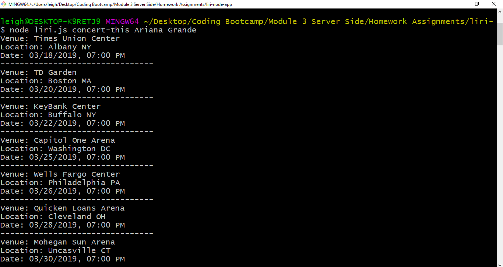
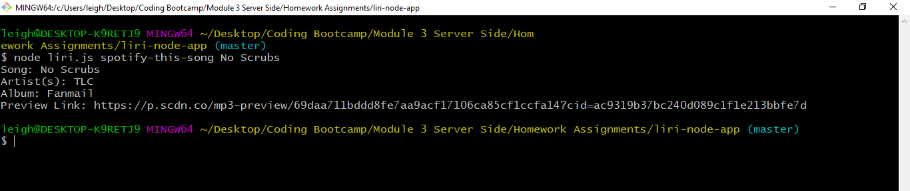
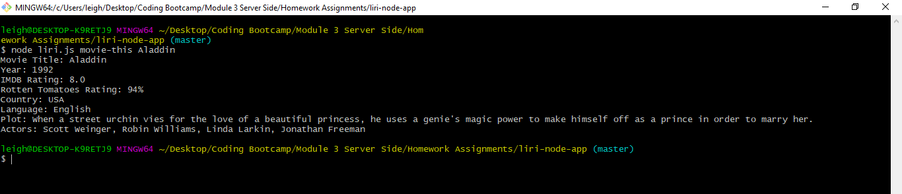

# liri-node-app

LIRI is a CLI application that searches Spotify for songs, Bands in Town for concerts, and OMDB for movies.

### LIRI Commands

* #### concert-this
LIRI uses the Bands in Town Artist Events API to show information about an artist's upcoming shows.

* #### spotify-this-song
LIRI utilizes the node-spotify-api package to retrieve song information from the Spotify API. If no song is provided, LIRI will default to "The Sign" by Ace of Base.

* #### movie-this
LIRI retrieves data about a movie from the OMBD API.  If no movie is provided, LIRI will default to Mr. Nobody.

* #### do-what-it-says
LIRI will read the random.txt file and do what it says. The default example will run the spotify-this-song command for the song "I Want It That Way" by The Backstreet Boys.

